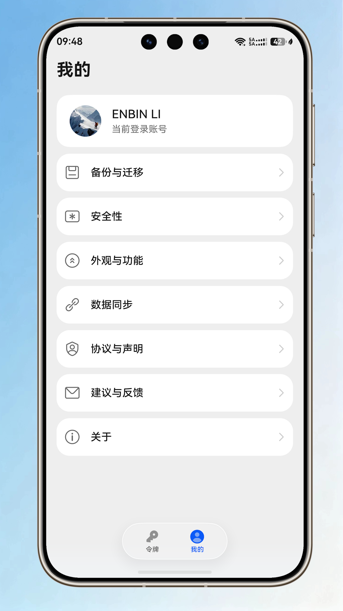
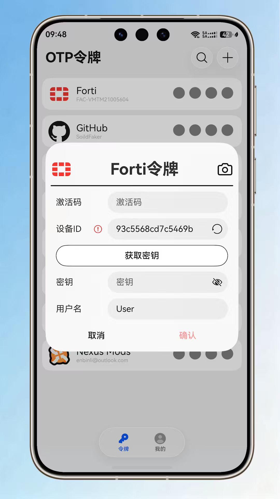
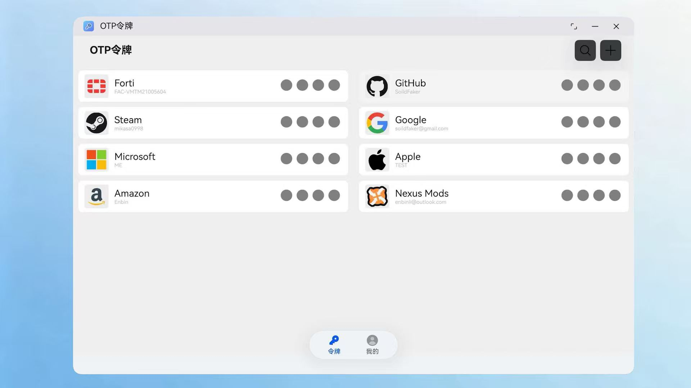
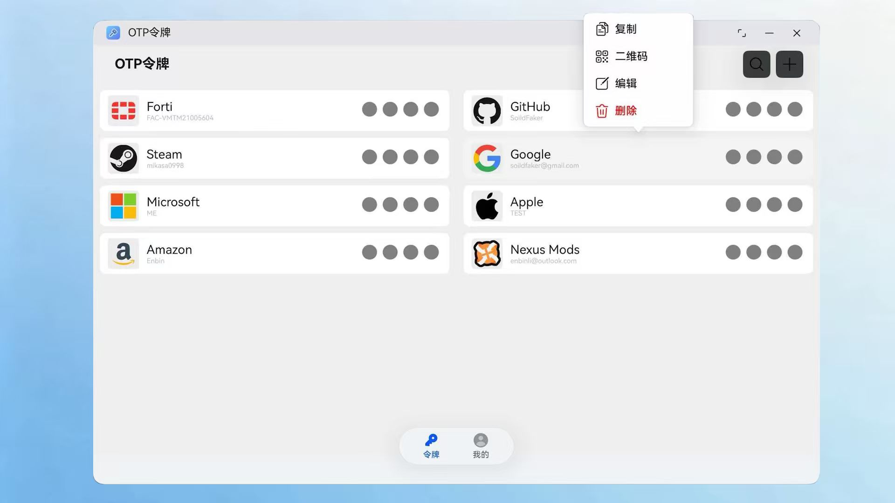
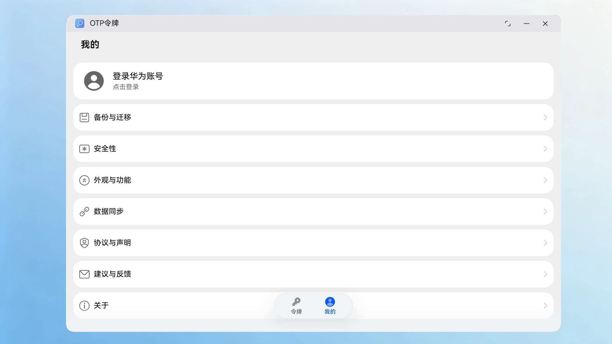
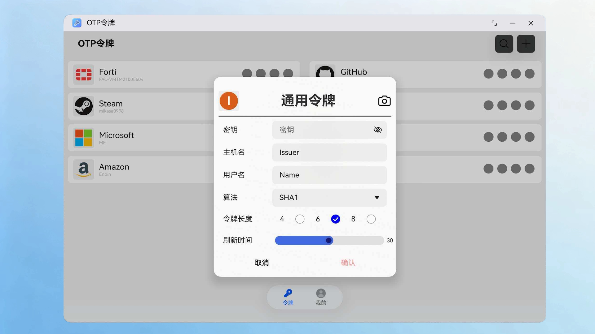

<h1 align="center">
 OTP Token
</h1>

   

[简体中文](docs/README_CN.md)

Open source OTP Authenticator for HarmonyOS NEXT.

## Feature

- [x] Support TOTP Token
- [x] Support HOTP Token
- [x] Support Steam Token, [Importing from Steam](https://github.com/stratumauth/app/wiki/Importing-from-Steam)
- [x] Support Forti Token
- [x] Setting Page
- [x] Asset Store Kit (TEE Hardware-backed Secret Storage)
- [x] Huawei Cloud Drive Backup & Restore (End-to-End Encrypted)
- [x] Device Migration via BackupExtensionAbility
- [x] Anti-Peeping Protection (DLP)
- [x] Desktop Widget (TOTP & HOTP)

---
<b>Phone</b>

  
  
  
  

<b>PC</b>

  
  
  
  

---

## Reference
- [paolostivanin/libcotp](https://github.com/paolostivanin/libcotp)
- [Netthaw/TOTP-MCU](https://github.com/Netthaw/TOTP-MCU)
- [ss23/fortitoken-mobile-registration](https://github.com/ss23/fortitoken-mobile-registration)
- [andOTP/andOTP](https://github.com/andOTP/andOTP): icons
- [iamhyc/Aigis](https://github.com/iamhyc/Aigis)
- [nanopb/nanopb](https://github.com/nanopb/nanopb): protobuf for google authenticator migration

## Contributors

Made with [contrib.rocks](https://contrib.rocks).
